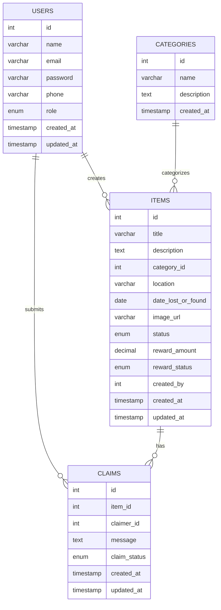

# ER Diagram

```mermaid
erDiagram
    USERS ||--o{ ITEMS : creates
    USERS ||--o{ CLAIMS : submits
    ITEMS ||--o{ CLAIMS : has
    CATEGORIES ||--o{ ITEMS : categorizes

    USERS {
        int id
        varchar name
        varchar email
        varchar password
        varchar phone
        enum role
        timestamp created_at
        timestamp updated_at
    }

    CATEGORIES {
        int id
        varchar name
        text description
        timestamp created_at
    }

    ITEMS {
        int id
        varchar title
        text description
        int category_id
        varchar location
        date date_lost_or_found
        varchar image_url
        enum status
        decimal reward_amount
        enum reward_status
        int created_by
        timestamp created_at
        timestamp updated_at
    }

    CLAIMS {
        int id
        int item_id
        int claimer_id
        text message
        enum claim_status
        timestamp created_at
        timestamp updated_at
    }
```
