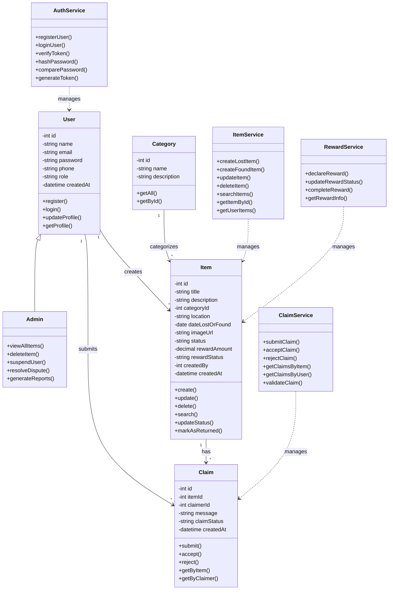

# Class Diagram

```mermaid
classDiagram
    class User {
        -int id
        -string name
        -string email
        -string password
        -string phone
        -string role
        -datetime createdAt
        +register()
        +login()
        +updateProfile()
        +getProfile()
    }

    class Admin {
        +viewAllItems()
        +deleteItem()
        +suspendUser()
        +resolveDispute()
        +generateReports()
    }

    class Item {
        -int id
        -string title
        -string description
        -int categoryId
        -string location
        -date dateLostOrFound
        -string imageUrl
        -string status
        -decimal rewardAmount
        -string rewardStatus
        -int createdBy
        -datetime createdAt
        +create()
        +update()
        +delete()
        +search()
        +updateStatus()
        +markAsReturned()
    }

    class Claim {
        -int id
        -int itemId
        -int claimerId
        -string message
        -string claimStatus
        -datetime createdAt
        +submit()
        +accept()
        +reject()
        +getByItem()
        +getByClaimer()
    }

    class Category {
        -int id
        -string name
        -string description
        +getAll()
        +getById()
    }

    class AuthService {
        +registerUser()
        +loginUser()
        +verifyToken()
        +hashPassword()
        +comparePassword()
        +generateToken()
    }

    class ItemService {
        +createLostItem()
        +createFoundItem()
        +updateItem()
        +deleteItem()
        +searchItems()
        +getItemById()
        +getUserItems()
    }

    class ClaimService {
        +submitClaim()
        +acceptClaim()
        +rejectClaim()
        +getClaimsByItem()
        +getClaimsByUser()
        +validateClaim()
    }

    class RewardService {
        +declareReward()
        +updateRewardStatus()
        +completeReward()
        +getRewardInfo()
    }

    User <|-- Admin
    User "1" --> "*" Item : creates
    User "1" --> "*" Claim : submits
    Item "1" --> "*" Claim : has
    Category "1" --> "*" Item : categorizes
    
    AuthService ..> User : manages
    ItemService ..> Item : manages
    ClaimService ..> Claim : manages
    RewardService ..> Item : manages
```
