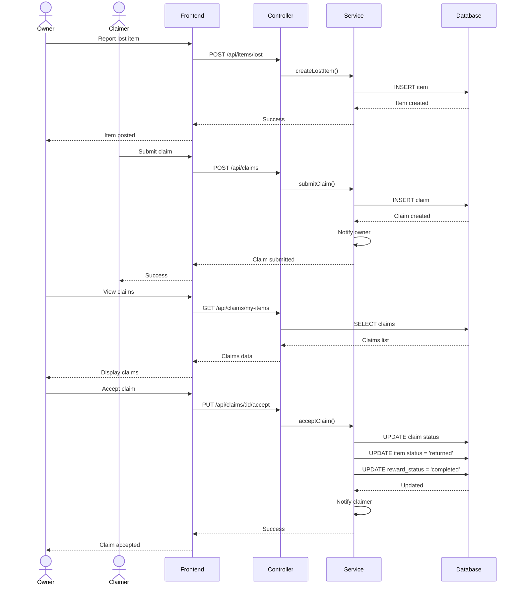

# Sequence Diagram

```mermaid
sequenceDiagram
    actor Owner
    actor Claimer
    participant Frontend
    participant Controller
    participant Service
    participant Database

    Owner->>Frontend: Report lost item
    Frontend->>Controller: POST /api/items/lost
    Controller->>Service: createLostItem()
    Service->>Database: INSERT item
    Database-->>Service: Item created
    Service-->>Frontend: Success
    Frontend-->>Owner: Item posted

    Claimer->>Frontend: Submit claim
    Frontend->>Controller: POST /api/claims
    Controller->>Service: submitClaim()
    Service->>Database: INSERT claim
    Database-->>Service: Claim created
    Service->>Service: Notify owner
    Service-->>Frontend: Claim submitted
    Frontend-->>Claimer: Success

    Owner->>Frontend: View claims
    Frontend->>Controller: GET /api/claims/my-items
    Controller->>Database: SELECT claims
    Database-->>Controller: Claims list
    Controller-->>Frontend: Claims data
    Frontend-->>Owner: Display claims

    Owner->>Frontend: Accept claim
    Frontend->>Controller: PUT /api/claims/:id/accept
    Controller->>Service: acceptClaim()
    Service->>Database: UPDATE claim status
    Service->>Database: UPDATE item status = 'returned'
    Service->>Database: UPDATE reward_status = 'completed'
    Database-->>Service: Updated
    Service->>Service: Notify claimer
    Service-->>Frontend: Success
    Frontend-->>Owner: Claim accepted
```
