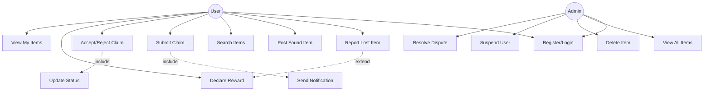

# Use Case Diagram

```mermaid
graph TB
    User((User))
    Admin((Admin))
    
    User --> UC1[Register/Login]
    User --> UC2[Report Lost Item]
    User --> UC3[Post Found Item]
    User --> UC4[Search Items]
    User --> UC5[Submit Claim]
    User --> UC6[Accept/Reject Claim]
    User --> UC7[Declare Reward]
    User --> UC8[View My Items]
    
    Admin --> UC1
    Admin --> UC9[View All Items]
    Admin --> UC10[Delete Item]
    Admin --> UC11[Suspend User]
    Admin --> UC12[Resolve Dispute]
    
    UC5 -.->|include| UC13[Send Notification]
    UC6 -.->|include| UC14[Update Status]
    UC2 -.->|extend| UC7
```
